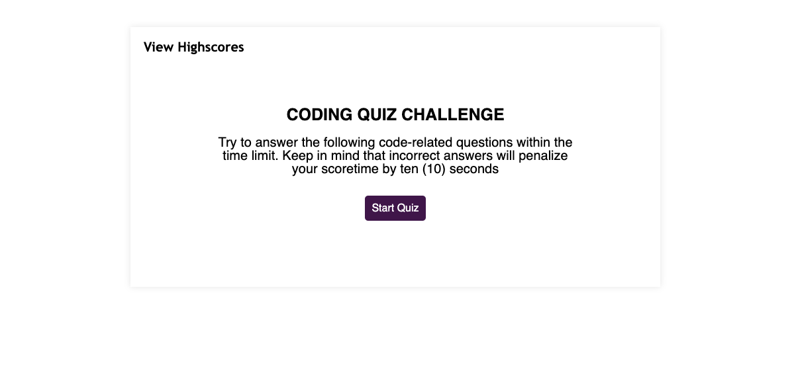

# Coding Quiz Challenge

Welcome to the Coding Quiz Challenge! Test your JavaScript knowledge with a series of code-related questions. Try to answer as many questions as you can within the time limit. Be cautious, as incorrect answers will result in a time penalty.

## Table of Contents

1. [Installation](#Installation)
2. [Getting Started](#getting-started)
3. [Quiz Structure](#quiz-structure)
4. [Instructions](#instructions)
5. [Code Structure](#code-structure)
6. [Contributing](#contributing)
7. [License](#license)
8. [Acknowledgments](#acknowledgments)
9. [Screenshot](#screenshot)

## Installation

To run the Coding Quiz Challenge on your local machine, follow these steps:

1. **Clone the Repository:**
    ```bash
    git clone https://github.com/andersonasprilla/Code-Quiz.git
    ```

2. **Open the Project:**
    - Navigate to the project directory:
        ```bash
        cd code-quiz
        ```

3. **Run the Quiz:**
    - Open the `index.html` file in a web browser to start the quiz.

4. **Enjoy Coding:**
    - Have fun testing your JavaScript skills!

Make sure you have Git installed on your machine before cloning the repository.

If you encounter any issues during the installation process, feel free to reach out or check the [Contributing](#contributing) section for assistance.

## Getting Started

1. Clone the repository to your local machine.
2. Open the `index.html` file in a web browser to start the quiz.

## Quiz Structure

- The quiz consists of multiple-choice questions related to JavaScript.
- Each question has a set of options, and you need to choose the correct one.
- Correct answers contribute to your score, while incorrect answers result in a time penalty.

## Instructions

1. Click the "Start Quiz" button to begin.
2. Answer each question by clicking on the provided options.
3. Watch out for the timer; it will affect your final score.
4. After completing the quiz or if the timer reaches 0, enter your initials to save your score.

## Code Structure

- The JavaScript code for the quiz is organized into functions to handle different aspects of the quiz flow.
- Timer, question loading, answer handling, and score display are all managed through JavaScript.

## Contributing

Feel free to contribute by submitting bug reports, feature requests, or enhancements. Your input is valuable!

## License

This project is licensed under the [MIT License](LICENSE.md).

## Acknowledgments

- This quiz template was created for learning and educational purposes.

Have fun coding and testing your JavaScript skills!

## Screenshot

